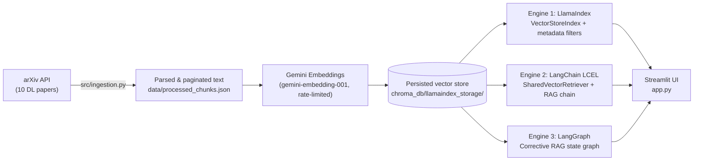
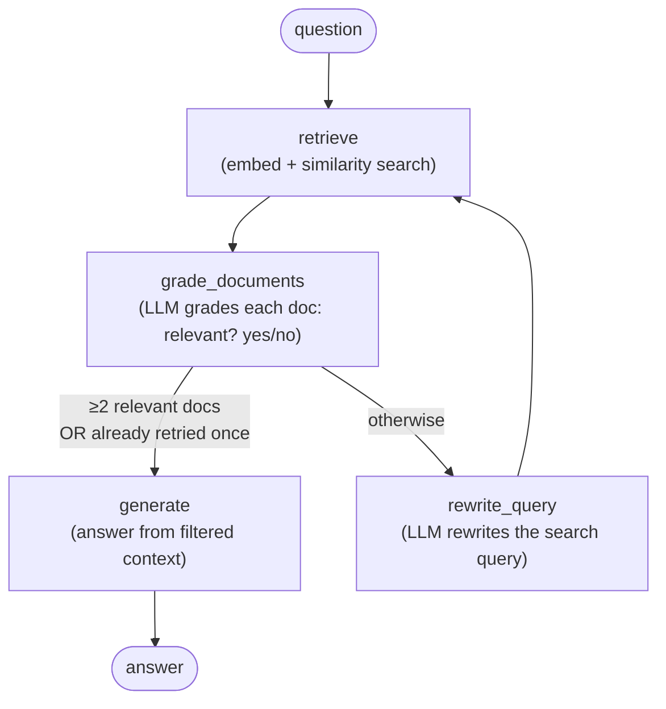

# 🧠 Tri-Engine Deep Learning RAG Assistant

A single knowledge base of 10 seminal Deep Learning papers, answered by **three different Retrieval-Augmented Generation architectures side by side** — **LlamaIndex**, **LangChain (LCEL)**, and **LangGraph (Corrective RAG)** — so you can directly compare how each framework retrieves, reasons about, and answers the same research question.


---

## Table of Contents

- [Overview](#overview)
- [Why Three Engines?](#why-three-engines)
- [Architecture](#architecture)
- [The Three Engines Explained](#the-three-engines-explained)
  - [1. LlamaIndex](#1-llamaindex--index-centric-rag)
  - [2. LangChain (LCEL)](#2-langchain-lcel--composable-chain-rag)
  - [3. LangGraph (Corrective RAG)](#3-langgraph--corrective-rag-crag)
  - [Engine Comparison](#engine-comparison)
  - [Which Engine Should You Use?](#which-engine-should-you-use)
- [Knowledge Base](#knowledge-base)
- [Notable Design Decisions](#notable-design-decisions)
- [Tech Stack](#tech-stack)
- [Project Structure](#project-structure)
- [Getting Started](#getting-started)
  - [Prerequisites](#prerequisites)
  - [Installation](#installation)
  - [Configuration](#configuration)
  - [1. Ingest the Corpus](#1-ingest-the-corpus)
  - [2. Launch the App](#2-launch-the-app)
- [Usage](#usage)
- [License](#license)
- [Author](#author)

---

## Overview

**Tri-Engine RAG** is a Streamlit application that ingests 10 foundational Deep Learning papers directly from arXiv, embeds them with Google's Gemini embedding model, and exposes **three independently implemented RAG pipelines** over the exact same underlying data. Instead of picking one framework and hoping it's the right choice, this project lets you run any single engine or **compare all three, side by side, on the same query** — with latency and retrieved citations shown for each.

It exists to answer a practical question: *for a given retrieval-augmented question-answering task, how do LlamaIndex, LangChain, and LangGraph actually differ in behavior, structure, and answer quality — not just in theory, but on identical data and identical questions?*

## Why Three Engines?

LlamaIndex, LangChain, and LangGraph are often discussed as interchangeable "RAG frameworks," but they encode fairly different philosophies:

- **LlamaIndex** is *data-framework-first* — indexes, retrievers, and query engines are first-class objects.
- **LangChain (LCEL)** is *pipeline-first* — you compose small, explicit `Runnable` steps with the `|` operator.
- **LangGraph** is *control-flow-first* — you model the RAG process as a graph of nodes and conditional edges, enabling loops, retries, and self-correction.

This project implements all three against the same corpus so the differences show up in practice: response latency, answer style, and — most importantly — whether the pipeline can recognize and recover from a bad retrieval.

## Architecture



The vector store is built **once**, by the LlamaIndex engine, and then **reused** by the other two engines (see [Notable Design Decisions](#notable-design-decisions)) — so all three engines retrieve from the same embeddings, and any difference in their answers comes from the retrieval/generation *logic*, not from different data.

## The Three Engines Explained

### 1. LlamaIndex — Index-Centric RAG

**File:** `src/llamaindex_engine.py`

The baseline engine. It builds a `VectorStoreIndex` from the paginated paper text (chunked with a `SentenceSplitter` at 2048 characters / 128 overlap) and answers questions through LlamaIndex's native `query_engine`, which handles retrieval and synthesis in one call. It's also the engine responsible for **building and persisting the shared vector store** the other two engines reuse.

Key characteristics:
- One-shot pipeline: retrieve top-*k* nodes → synthesize an answer.
- **Native metadata filtering** — the UI's "Domain Filter" (e.g. restrict retrieval to *Computer Vision* or *Optimization* papers) is implemented with LlamaIndex's `MetadataFilters`, something the other two engines don't expose.
- Uses a custom `RateLimitedGoogleEmbedding` wrapper to stay under Google's free-tier 15 requests/minute quota during embedding.

### 2. LangChain (LCEL) — Composable Chain RAG

**File:** `src/langchain_engine.py`

Implements the same retrieve-then-generate pattern, but as an explicit **LangChain Expression Language (LCEL)** chain — a pipe (`|`) of small, swappable `Runnable` steps:

```
{context, question} → prompt_template → llm → StrOutputParser
```

Rather than rebuilding an index, this engine's `SharedVectorRetriever` loads the embeddings LlamaIndex already persisted and performs its own **in-memory cosine-similarity search with NumPy** (vectors are L2-normalized so similarity is a plain dot product). This makes the engine lightweight — no external vector database, no re-embedding of the corpus — at the cost of implementing retrieval manually rather than relying on a framework abstraction.

Key characteristics:
- Fully declarative, inspectable chain — every step is a named, composable unit.
- No self-correction: if retrieval is weak, the chain still generates an answer from whatever it retrieved.
- No topic filtering.

### 3. LangGraph — Corrective RAG (CRAG)

**File:** `src/langgraph_engine.py`

The most sophisticated of the three. Instead of a straight line from question to answer, this engine models the process as a **stateful graph** (`StateGraph`) with four nodes and a conditional edge:



After retrieval, an LLM **grades each retrieved chunk** for relevance (structured `yes`/`no` output). If fewer than two chunks pass the grader — and the query hasn't already been rewritten once — the graph **rewrites the query** into a more effective technical search query and retries retrieval. Only once enough relevant context is available does it generate the final answer. This is the classic **Corrective RAG** pattern: the pipeline can recognize a bad retrieval and correct itself instead of confidently answering from weak context.

Key characteristics:
- Self-correcting: can rewrite the query and re-retrieve (bounded to one retry).
- Reuses the same `SharedVectorRetriever` as the LangChain engine.
- Reports the `transformed_query` back to the UI whenever a rewrite occurred.
- Highest latency of the three, since grading (and possibly a rewrite) adds extra LLM calls before generation even starts.

### Engine Comparison

| | **LlamaIndex** | **LangChain (LCEL)** | **LangGraph (Corrective RAG)** |
|---|---|---|---|
| **Paradigm** | Index-centric | Composable chain (pipe operator) | Stateful graph / control flow |
| **Retrieval** | Native `VectorStoreIndex` query engine | Manual cosine-similarity over reused embeddings | Same manual retriever, wrapped in a grading loop |
| **Query flow** | Single-shot: retrieve → synthesize | Single-shot: retrieve → prompt → LLM | Multi-step: retrieve → grade → (rewrite → retrieve) → generate |
| **Self-correction** | No | No | Yes — grades relevance, rewrites query, retries once |
| **Topic/metadata filtering** | Yes | No | No |
| **Extra LLM calls per query** | None beyond generation | None beyond generation | 1 grading call per retrieved doc, +1 more on a rewrite |
| **Relative latency** | Fastest | Fast | Slowest |
| **Best for** | Fast prototyping, filtered/faceted search | Full control over pipeline steps | Higher answer reliability under uncertain retrieval |

### Which Engine Should You Use?

- **Use LlamaIndex** when you want an index-first pattern with built-in persistence and metadata filtering out of the box, or when you need fast answers and are less concerned with retrieval edge cases.
- **Use LangChain (LCEL)** when you want full, explicit control over every stage of the pipeline — prompt construction, retrieval, output parsing — as separate, swappable, composable steps, especially if the RAG pipeline needs to plug into a larger LangChain-based system.
- **Use LangGraph (Corrective RAG)** when answer *reliability* matters more than speed — e.g. production question-answering where a bad retrieval should trigger a retry rather than a confidently wrong answer.

## Knowledge Base

The corpus is built from 10 papers, fetched live from arXiv by `src/ingestion.py`:

| # | Paper | arXiv ID | Topic |
|---|---|---|---|
| 1 | Attention Is All You Need | `1706.03762` | Transformer Architecture |
| 2 | Deep Residual Learning for Image Recognition (ResNet) | `1512.03385` | Computer Vision |
| 3 | BERT: Pre-training of Deep Bidirectional Transformers | `1810.04805` | NLP / Pre-training |
| 4 | Language Models are Few-Shot Learners (GPT-3) | `2005.14165` | Large Language Models |
| 5 | Generative Adversarial Nets (GAN) | `1406.2661` | Generative Models |
| 6 | Denoising Diffusion Probabilistic Models (DDPM) | `2006.11239` | Generative Models |
| 7 | LoRA: Low-Rank Adaptation of Large Language Models | `2106.09685` | Model Fine-tuning |
| 8 | Retrieval-Augmented Generation for Knowledge-Intensive NLP | `2005.11401` | RAG Foundations |
| 9 | Adam: A Method for Stochastic Optimization | `1412.6980` | Optimization |
| 10 | ImageNet Classification with Deep CNNs (AlexNet) | `1404.5997` | Convolutional Networks |

Each paper is downloaded as a PDF, parsed page-by-page with `pypdf`, and saved with its title, topic, authors, publication year, and abstract into `data/processed_chunks.json`.

## Notable Design Decisions

- **One embedding pass, three engines.** Only the LlamaIndex engine calls the embedding API to build the index. The LangChain and LangGraph engines read that same persisted store (`default__vector_store.json` + `docstore.json`) and run their own NumPy cosine-similarity search on the vectors already computed — avoiding duplicate embedding calls and keeping all three engines aligned on identical retrieval data.
- **Free-tier-aware embedding.** `RateLimitedGoogleEmbedding` batches embedding requests (5 at a time), sleeps between batches, and backs off with increasing delays on `429 RESOURCE_EXHAUSTED` errors, so the initial index build stays under Google's 15 requests/minute free-tier quota.
- **Storage is JSON-based, not a live vector database.** Despite `chromadb` and `faiss-cpu` being listed as dependencies, the current implementation persists the index using LlamaIndex's default local storage (JSON files under `chroma_db/llamaindex_storage/`) rather than a running Chroma or FAISS instance — those packages are available for a future swap but aren't wired in yet.
- **Bounded self-correction.** LangGraph's corrective loop is capped at one rewrite-and-retry to avoid infinite loops if the grader keeps rejecting documents.

## Tech Stack

| Category | Technology |
|---|---|
| UI | [Streamlit](https://streamlit.io/) |
| RAG frameworks | [LlamaIndex](https://www.llamaindex.ai/), [LangChain](https://www.langchain.com/) (LCEL), [LangGraph](https://www.langchain.com/langgraph) |
| LLM & Embeddings | Google Gemini (`gemini-3.6-flash`, `gemini-embedding-001`) via `langchain-google-genai` and `llama-index-llms-google-genai` |
| Data source | [arXiv API](https://pypi.org/project/arxiv/) |
| PDF parsing | `pypdf` |
| Numerics | `numpy` (manual similarity search) |
| Validation | `pydantic` (structured LLM output for document grading) |
| Package management | [uv](https://docs.astral.sh/uv/) (`uv.lock` included) |

## Project Structure

```
tri-engine-rag/
├── app.py                      # Streamlit UI — loads all 3 engines, handles single/compare modes
├── pyproject.toml              # Project metadata & dependencies
├── uv.lock                     # Locked dependency versions
├── .env.example                # Template for required environment variables
├── src/
│   ├── __init__.py
│   ├── ingestion.py            # Downloads & parses the 10 arXiv papers → data/processed_chunks.json
│   ├── llamaindex_engine.py    # Engine 1 — builds & persists the shared vector index
│   ├── langchain_engine.py     # Engine 2 — LCEL chain reusing the persisted vectors
│   └── langgraph_engine.py     # Engine 3 — Corrective RAG graph reusing the persisted vectors
├── data/                       # Generated — raw PDFs + processed_chunks.json (gitignored)
└── chroma_db/                  # Generated — persisted vector store (gitignored)
```

## Getting Started

### Prerequisites

- Python 3.10+
- A [Google Gemini API key](https://ai.google.dev/) (free tier works — the embedding call path is rate-limited for it)
- [uv](https://docs.astral.sh/uv/) (recommended, since `uv.lock` is included) or `pip`

### Installation

```bash
git clone https://github.com/soroushesnaashari/tri-engine-rag.git
cd tri-engine-rag

# Using uv (recommended)
uv sync

# Or using pip
python -m venv .venv
source .venv/bin/activate      # Windows: .venv\Scripts\activate
pip install .
```

### Configuration

Copy the example environment file and add your API key:

```bash
cp .env.example .env
```

```env
GOOGLE_API_KEY=your_gemini_api_key_here
```

### 1. Ingest the Corpus

Run the ingestion script once to download the 10 papers and prepare the text data:

```bash
python -m src.ingestion
```

This creates `data/raw_pdfs/` (the downloaded PDFs) and `data/processed_chunks.json` (the parsed, page-level text used for indexing).

### 2. Launch the App

```bash
streamlit run app.py
```

On first launch, the LlamaIndex engine embeds every chunk and persists the index to `chroma_db/llamaindex_storage/` (this is rate-limited and can take a few minutes on the free tier). The LangChain and LangGraph engines then load that same persisted data — so the first run must fully complete the LlamaIndex build before the other two engines can be used. Subsequent launches load the existing index instantly.

If you'd rather build the index ahead of time without opening the UI:

```bash
python -m src.llamaindex_engine
```

Each engine file also runs a standalone test query when executed directly, e.g.:

```bash
python -m src.langchain_engine
python -m src.langgraph_engine
```

## Usage

In the Streamlit sidebar:

- **Execution Mode** — choose **Single Engine** to query one engine at a time, or **Compare All Engines Side-by-Side** to run the same question through all three at once.
- **Engine Selection** — (Single Engine mode only) pick LangGraph, LangChain, or LlamaIndex.
- **Domain Filter** — restricts LlamaIndex's retrieval to a specific paper topic (e.g. *Optimization*, *Generative Models*). Only affects the LlamaIndex engine.
- **Load Sample Query** — a dropdown of pre-written benchmark questions covering ResNet, Transformers, BERT, LoRA, and the Adam optimizer.

After clicking **Execute**, each engine's panel shows:
- The **answer**, generated only from retrieved context.
- **Latency** in seconds.
- The **transformed query** (LangGraph only, shown when a query rewrite occurred).
- An expandable **Retrieved Source Citations** panel — paper title, page number, topic, similarity score, and a text snippet for every chunk used.

In Compare mode, a **Summary Statistics** table at the bottom shows latency and citation count for all three engines on the same question, for a direct side-by-side comparison.

## License

No license file is currently included in this repository, so the code defaults to standard copyright — all rights reserved by the author. If you intend for others to use, modify, or distribute this project, consider adding a license (e.g. MIT or Apache 2.0).

## Author

[Mohammad Soroush Esnaashari](https://soroushesnaashari.github.io/)
